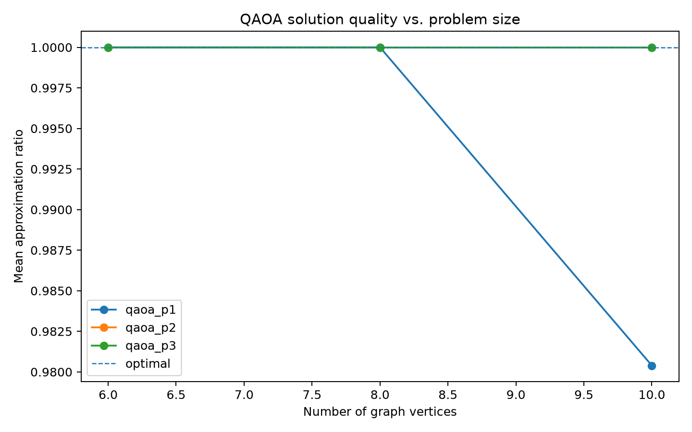
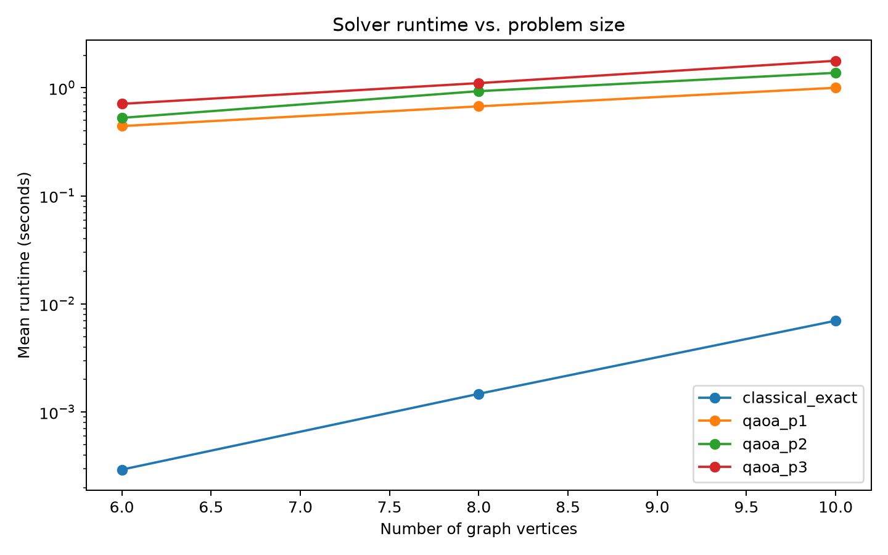

# Quantum vs. Classical Optimization: Max-Cut with QAOA

A numerical study comparing the Quantum Approximate Optimization Algorithm (QAOA) with an exact classical solver on small Max-Cut problems.

## Research Question

How does QAOA compare with a classical exact method on small combinatorial optimization problems as graph size and QAOA circuit depth increase?

This project uses simulation to study solution quality and computational cost. It does **not** claim quantum advantage.

## Method

Random connected graphs are generated with 6, 8, and 10 nodes using multiple random seeds.

For each graph:

1. Solve Max-Cut exactly using classical brute-force enumeration.
2. Formulate Max-Cut as a binary quadratic optimization problem.
3. Solve the same problem using QAOA with circuit depths:
   - p = 1
   - p = 2
   - p = 3
4. Compare QAOA with the known classical optimum using:

   **Approximation Ratio = QAOA Cut Value / Exact Optimal Cut Value**

5. Record runtime for each method.

## Results

Across the tested 6- and 8-node instances, all QAOA depths recovered the exact optimal cut.

For one 10-node instance, QAOA at p = 1 produced a cut value of 16 compared with the exact optimum of 17:

**Approximation ratio = 16 / 17 = 0.941**

Increasing the depth to p = 2 recovered the optimal cut of 17. QAOA at p = 3 also recovered the optimum but required additional simulation time.

Across the three 10-node instances:

| Method | Mean Approximation Ratio | Mean Runtime (s) |
|---|---:|---:|
| Classical Exact | 1.0000 | 0.0070 |
| QAOA p=1 | 0.9804 | 1.0008 |
| QAOA p=2 | 1.0000 | 1.3765 |
| QAOA p=3 | 1.0000 | 1.7785 |

These experiments illustrate a solution-quality versus computational-cost tradeoff as QAOA circuit depth increases. For these small simulated instances, the classical exact solver remains substantially faster.

## Experimental Results

### Approximation Ratio



### Runtime



Full experimental data are available in [`results/benchmark_results.csv`](results/benchmark_results.csv).

## Project Structure

```text
quantum-vs-classical-maxcut/
├── src/
│   ├── classical.py
│   ├── problem.py
│   ├── quantum.py
│   └── visualization.py
├── results/
│   ├── benchmark_results.csv
│   ├── approximation_ratio.png
│   └── runtime.png
├── run_experiment.py
├── environment.yml
├── requirements.txt
└── README.md
```

## Tools

- Python
- Qiskit
- Qiskit Optimization
- NumPy
- pandas
- NetworkX
- Matplotlib
- Conda

## Reproducing the Experiment

Create the Conda environment:

```bash
conda env create -f environment.yml
conda activate quantum-maxcut
```

Run the benchmark:

```bash
python run_experiment.py
```

Results are automatically written to the `results/` directory.

## Possible Extensions

Future experiments could investigate:

- Larger graph instances
- Weighted Max-Cut
- Additional QAOA depths and optimizer settings
- More random graph seeds and graph densities
- Noisy quantum simulation
- Alternative classical heuristics
- Statistical variability across repeated QAOA runs